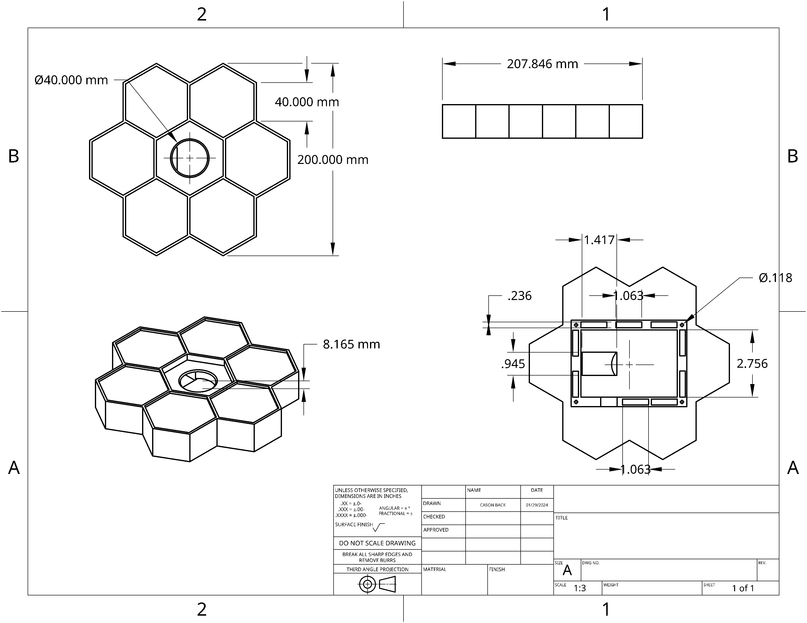
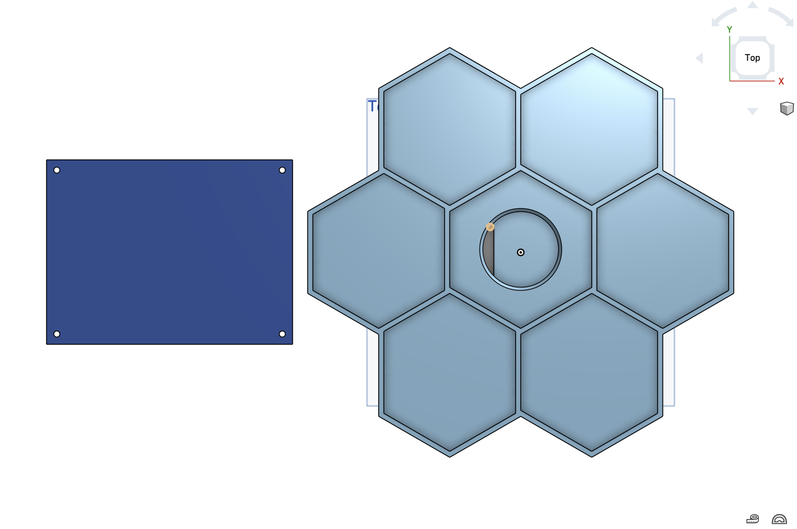

# Honey Scan

This is a project creating a tool that scans groceries as they are put into the fridge.
It was inspired by the barcode scanning functionality of the app MyFitnessPal. The goal is to create something
that is convenient for the user to keep track of what they have in their fridge, while keeping it at an affordable price
compared to smart fridges that have similar technology, but are priced at thousands of dollars.

